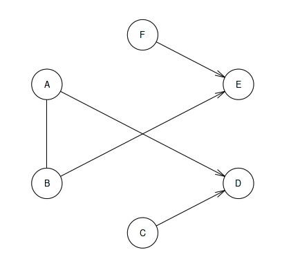

# Parallel-R
Through this project, we set up a distributed R cluster, leveraging the parallel package. The [parallel](https://www.rdocumentation.org/packages/parallel/versions/3.6.2) package offers support for parallel computation by forking parallel process (based on the [multicore](https://cran.r-project.org/src/contrib/Archive/multicore/) package) on the same machine thus utilizing most of the cores of the machine. In addition to it, the package also offers communication using sockets (obtained from the [snow](https://cran.r-project.org/web/packages/snow/index.html) package) parallelizing the computation utlizing the resources of the nodes in the cluster.

We then study Bayesian structure learning, by learning the Bayesian structure on a sample dataset, using the [bnlearn](https://www.bnlearn.com/) package. The dataset is split into equal parts, based on the number of nodes in the cluster. A network structure is learnt over each split paralelly and aggregated to output the final structure.

## Dataset
The sample data used is obtained from [learning.test](https://www.bnlearn.com/documentation/man/learning-test.html) a small synthetic dataset compirsing of 6 nodes, 5 arcs and 41 parameters.
<p align="center">
  
</p>
<p align="center">Fig. 1 - <i>learning.test</i> Network (Ref: https://www.bnlearn.com/documentation/networks/)</p>

## Execution
* To setup a distributed R cluster
    ```
    cd scripts && ./configure.sh --machines <MACHINES> --user <USERNAME> --key <PRIVATE_KEY>
    ```
    <table>
        <tr>
            <td><b>Parameter</b></td>
            <td><b>Default</b></td>
            <td><b>Description</b></td>
        </tr>
        <tr>
            <td>--machines</td>
            <td>../conf/machine_list.txt</td>
            <td>A file listing the public IP addresses of the nodes.</td>
        </tr>
        <tr>
            <td>--user</td>
            <td>${USER}</td>
            <td>User name, if different from the current user name.</td>
        </tr>
        <tr>
            <td>--key</td>
            <td>~/.ssh/id_rsa</td>
            <td>Path to the private key.</td>
        </tr>
    </table>
    Eg:
    
    ```
    cd scripts && ./configure.sh --machines ../conf/machine_list.txt --user arung --key ~/.ssh/id_rsa
    ```
    
* To learn the Bayesian network
    ```
    ./exec.sh --machines <MACHINES> --user <USERNAME> --key <PRIVATE_KEY> --inp <INPUT_DATA> --data <DATA_DIR>
    ```
    <table>
        <tr>
            <td><b>Parameter</b></td>
            <td><b>Default</b></td>
            <td><b>Description</b></td>
        </tr>
        <tr>
            <td>--machines</td>
            <td>../conf/machine_list.txt</td>
            <td>A file listing the public IP addresses of the nodes.</td>
        </tr>
        <tr>
            <td>--user</td>
            <td>${USER}</td>
            <td>User name, if different from the current user name.</td>
        </tr>
        <tr>
            <td>--key</td>
            <td>~/.ssh/id_rsa</td>
            <td>Path to the private key.</td>
        </tr>
        <tr>
            <td>--inp</td>
            <td>~/.ssh/id_rsa</td>
            <td>CSV File </td>
        </tr>
        <tr>
            <td>--data</td>
            <td>/mydata</td>
            <td>Path to the directory to install R packages and save data splits and other metadata.</td>
        </tr>
    </table>
    Eg:
    
    ```
    ./exec.sh --machines conf/machine_list.txt --user arung --key ~/.ssh/id_rsa --inp data/Sample_Data.csv --data /mydata
    ```

## References
* [Learning Bayesian Networks 10 Years Later - Marco Scutari](https://www.bnlearn.com/about/slides/slides-aist17.pdf)
* [Parallel Package](https://www.rdocumentation.org/packages/parallel/versions/3.6.2)
* [Sample Data](https://www.bnlearn.com/documentation/man/learning-test.html)
* [Example Networks](https://www.bnlearn.com/documentation/networks/)
